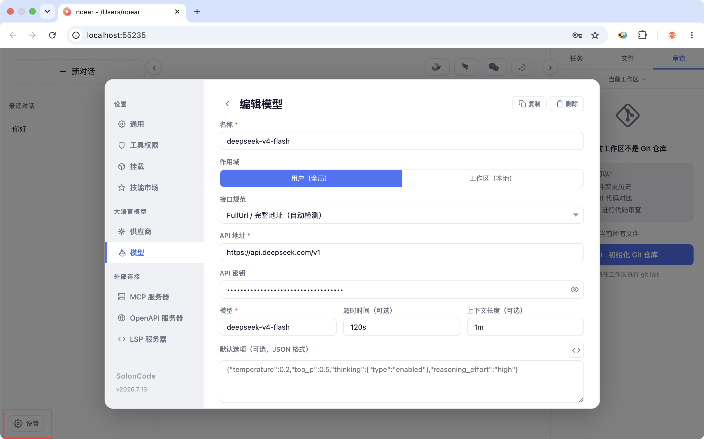

<div align="center">
<h1>SolonCode</h1>
<p>Открытый исходный код интеллектуального агента для программирования, построенный на <a href="https://github.com/opensolon/solon-ai">Solon AI</a> и Java (поддерживает среды выполнения Java8 до Java26)</p>
<p>Последняя версия: v2026.9.10</p>


<br />

</div>

<div align="center">

[中文](README.zh-CN.md) | [繁體中文](README.zh-TW.md) | [日本語](README.ja.md) | [한국어](README.ko.md) | [Deutsch](README.de.md) | [Français](README.fr.md) | [Español](README.es.md) | [Italiano](README.it.md)

[Русский](README.ru.md) | [العربية](README.ar.md) | [Português (BR)](README.br.md) | [ไทย](README.th.md) | [Tiếng Việt](README.vi.md) | [Polski](README.pl.md)

[বাংলা](README.bn.md) | [Bosanski](README.bs.md) | [Dansk](README.da.md) | [Ελληνικά](README.gr.md) | [Norsk](README.no.md) | [Türkçe](README.tr.md) | [Українська](README.uk.md)

</div>

## Установка и настройка

Установка:

```bash
# Mac / Linux / Harmony PC:
curl -fsSL https://solon.noear.org/soloncode/setup.sh | bash

# Windows (PowerShell):
irm https://solon.noear.org/soloncode/setup.ps1 | iex
```

Настройка (новым пользователям рекомендуется сначала настроить через веб-страницу настроек):

```
soloncode web 0
```

После входа на страницу откройте "Настройки -> Большая языковая модель (LLM)", добавьте модель и проверьте подключение.



## апуск

Выполните команду `soloncode cli` (CLI-интерактивный) или `soloncode web 0` (Web-интерактивный) из любой директории в консоли (то есть вашей рабочей области).

* `soloncode cli` (CLI-интерактивный)

```bash
demo@MacBook-Pro ~ % soloncode cli
SolonCode v2026.9.10 PID-87950 Model:deepseek-v4-flash
/Users/demo
Tips: (esc) interrupt | /(tab) command | $(tab) skill | @(tab) agent

User
❯ 
```

* `soloncode web 0` (Web-интерактивный)

```bash
demo@MacBook-Pro ~ % soloncode web 0
SolonCode v2026.9.10 PID-73617 Model:deepseek-v4-flash
/path/demo
2026-07-09 11:26
Web interface: http://localhost:50488/
```

Тестирование функций (попробуйте следующие задачи, от простых к сложным):

* `你好`
* `用网络分析下 ai mcp 协议，然后生成个 ppt` // Рекомендуется предварительно установить некоторые навыки
* `帮我设计一个 agent team（设计案存为 demo-dis.md），开发一个 solon + java17 的经典权限管理系统（demo-web），前端用 vue3，界面要简洁好看`


## SolonCode Desktop

SolonCode Desktop — локальная IDE-версия SolonCode. Она объединяет диалоги с Agent, файлы проекта, редактор Monaco, встроенный терминал, изменения Git и выполнение задач в одном рабочем пространстве. Клиент создан на Tauri, React и TypeScript, а Java CLI отвечает за среду выполнения Agent, доступ к моделям и инструменты.

Основные возможности:

* **Режимы Agent** — выполнение с подтверждением, автоматическое редактирование, планирование только для чтения и непрерывное выполнение Goal.
* **Диалоги в контексте проекта** — изображения и файлы, контекст рабочего пространства, добавление задач во время выполнения и статистика модели, Token и времени.
* **Надёжные сессии** — постоянная история, долговременная память, откат, повторный апуск, безопасное удаление и контрольные точки.
* **Встроенные инструменты разработки** — файлы, редактор, терминал, Git, список задач, Skills, Agents, MCP, OpenAPI, LSP и автоматизации.

При запуске из исходного кода backend необходимо запустить отдельно:

~~~bash
# Терминал 1: backend для Desktop
soloncode serve 4808

# Терминал 2: клиент Desktop
cd soloncode-desktop
npm install
npm run tauri:dev
~~~

Режим разработки подключается к порту 4808 и не запускает и не обнаруживает процесс backend автоматически. Подробнее см. [README Desktop](soloncode-desktop/README.md) и [руководство по началу работы с SolonCode Desk](docs/soloncode-desk-getting-started.md).

## Документация

Для получения дополнительной информации о конфигурации посетите нашу [Официальную документацию](https://solon.noear.org/article/soloncode).

## Участие в разработке

Если вы хотите внести вклад в код, пожалуйста, прочитайте [Документацию для участников](https://solon.noear.org/article/623) перед отправкой PR.

## Разработка на основе SolonCode

Если вы используете "soloncode" в названии вашего проекта (например, "soloncode-dashboard" или "soloncode-app"), укажите в README, что проект не разрабатывается официально командой OpenSolon и не имеет к ней отношения.

## Часто задаваемые вопросы

Чем отличается от Claude Code?

Они функционально похожи, с ключевыми отличиями:

* Построен на Java, 100% с открытым исходным кодом. Совместим с BiSheng JDK (Huawei) и Harmony PC.
* Полностью управляется и создаётся на основе промптов на китайском языке
* Независим от провайдеров. Настраивайте модели по необходимости. Итерации моделей будут сокращать разрыв и снижать затраты, что делает гибкую настройку важной.
* Одновременно поддерживает интерфейс командной строки терминала (CLI), интерфейс браузера (WEB) и интерфейс десктопной IDE (Desktop).
* Поддерживает Web, протокол ACP для удалённого взаимодействия.
